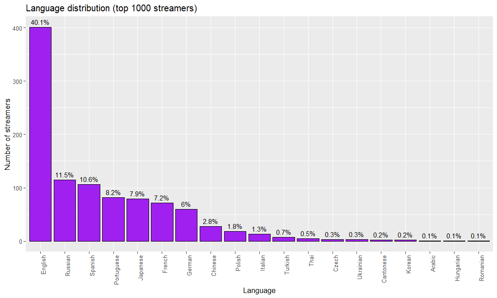
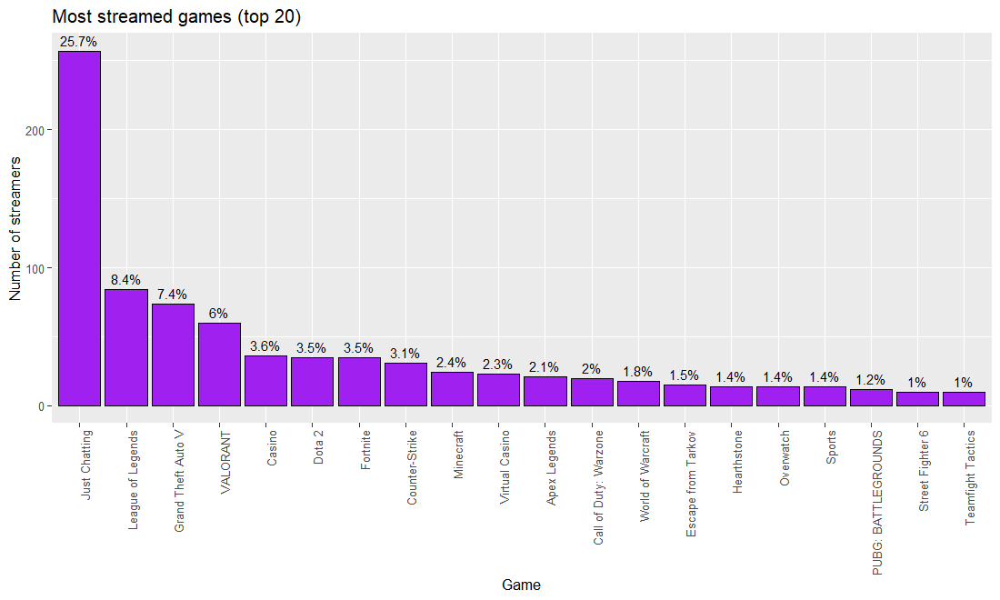
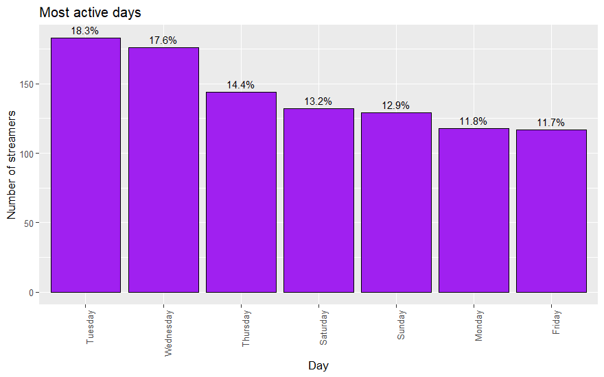
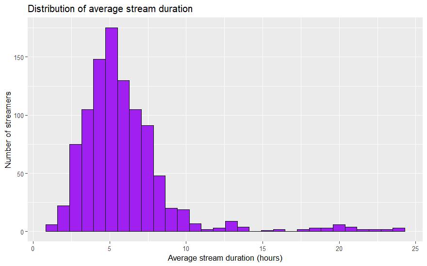
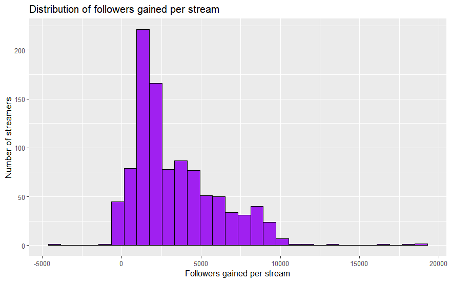
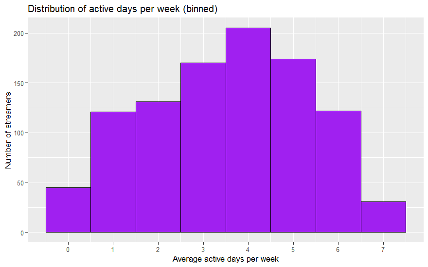

# 2. Univariate exploratory analysis

## Univariate exploratory analysis

In this second part we analyse the most relevant variables one at a time. Remember the question of the project: **how can a streamer, especially in the early years, identify and prioritise the strategies that maximise growth on Twitch?**

We start with three categorical variables:

- `language`
- `most_streamed_game`
- `most_active_day`

### Language


``` r
language_share <- data_twitch %>%
  count(language) %>%
  mutate(percentage = n / sum(n) * 100) %>%
  arrange(desc(n))
language_share
```

```
## # A tibble: 19 x 3
##    language       n percentage
##    <chr>      <int>      <dbl>
##  1 English      401     40.1  
##  2 Russian      115     11.5  
##  3 Spanish      106     10.6  
##  4 Portuguese    82      8.21 
##  5 Japanese      79      7.91 
##  6 French        72      7.21 
##  7 German        60      6.01 
##  8 Chinese       28      2.80 
##  9 Polish        18      1.80 
## 10 Italian       13      1.30 
## 11 Turkish        7      0.701
## 12 Thai           5      0.501
## 13 Czech          3      0.300
## 14 Ukrainian      3      0.300
## 15 Cantonese      2      0.200
## 16 Korean         2      0.200
## 17 Arabic         1      0.100
## 18 Hungarian      1      0.100
## 19 Romanian       1      0.100
```


``` r
ggplot(language_share, aes(x = reorder(language, -n), y = n)) +
  geom_bar(stat = "identity", fill = "purple", color = "black") +
  geom_text(aes(label = paste0(round(percentage, 1), "%")), vjust = -0.5, size = 3.5) +
  labs(title = "Language distribution (top 1000 streamers)",
       x = "Language", y = "Number of streamers") +
  theme(axis.text.x = element_text(angle = 90, hjust = 1))
```




English dominates the dataset (**40.1%** of the top 1,000), but Spanish still represents **10.6%**. A larger sample would probably show a similar pattern. This matters: streaming in English would increase the chances of becoming famous, but my friend's community speaks Spanish, so we will focus on that "filter" or, alternatively, recommend collaborations with English-speaking streamers. For now we analyse the main variables on the whole dataset, keeping the language in mind.

### Most streamed games

The most streamed games give a first hint of where viewers' interest is.


``` r
top_twenty_games <- data_twitch %>%
  count(most_streamed_game) %>%
  mutate(percentage = n / sum(n) * 100) %>%
  arrange(desc(n)) %>%
  head(20)
top_twenty_games
```

```
## # A tibble: 20 x 3
##    most_streamed_game        n percentage
##    <chr>                 <int>      <dbl>
##  1 Just Chatting           257      25.7 
##  2 League of Legends        84       8.41
##  3 Grand Theft Auto V       74       7.41
##  4 VALORANT                 60       6.01
##  5 Casino                   36       3.60
##  6 Dota 2                   35       3.50
##  7 Fortnite                 35       3.50
##  8 Counter-Strike           31       3.10
##  9 Minecraft                24       2.40
## 10 Virtual Casino           23       2.30
## 11 Apex Legends             21       2.10
## 12 Call of Duty: Warzone    20       2.00
## 13 World of Warcraft        18       1.80
## 14 Escape from Tarkov       15       1.50
## 15 Hearthstone              14       1.40
## 16 Overwatch                14       1.40
## 17 Sports                   14       1.40
## 18 PUBG: BATTLEGROUNDS      12       1.20
## 19 Street Fighter 6         10       1.00
## 20 Teamfight Tactics        10       1.00
```


``` r
ggplot(top_twenty_games, aes(x = reorder(most_streamed_game, -n), y = n)) +
  geom_bar(stat = "identity", fill = "purple", color = "black") +
  geom_text(aes(label = paste0(round(percentage, 1), "%")), vjust = -0.5, size = 3.5) +
  labs(title = "Most streamed games (top 20)",
       x = "Game", y = "Number of streamers") +
  theme(axis.text.x = element_text(angle = 90, hjust = 1))
```




**Just Chatting** is the most frequent main category (**25.7%** of streamers). It is a category where streamers just talk or do activities not tied to a specific game. It is followed, with a considerable gap, by **League of Legends, Grand Theft Auto V and VALORANT**.

### Most active days


``` r
most_active_days <- data_twitch %>%
  count(most_active_day) %>%
  mutate(percentage = n / sum(n) * 100) %>%
  arrange(desc(n))
most_active_days
```

```
## # A tibble: 7 x 3
##   most_active_day     n percentage
##   <chr>           <int>      <dbl>
## 1 Tuesday           183       18.3
## 2 Wednesday         176       17.6
## 3 Thursday          144       14.4
## 4 Saturday          132       13.2
## 5 Sunday            129       12.9
## 6 Monday            118       11.8
## 7 Friday            117       11.7
```


``` r
ggplot(most_active_days, aes(x = reorder(most_active_day, -n), y = n)) +
  geom_bar(stat = "identity", fill = "purple", color = "black") +
  geom_text(aes(label = paste0(round(percentage, 1), "%")), vjust = -0.5, size = 3.5) +
  labs(title = "Most active days", x = "Day", y = "Number of streamers") +
  theme(axis.text.x = element_text(angle = 90, hjust = 1))
```




Mid-week days dominate: **Tuesday, Wednesday and Thursday** together concentrate **50.4%** of the observations. This could reflect a tendency to stream on working days.

Next, the numeric variables:

- `average_stream_duration`
- `followers_gained_per_stream`
- `active_days_per_week`
- `total_time_streamed`
- `total_followers`

**Why these variables?** They help identify which behaviours and characteristics make streamers grow quickly: how the time streamed relates to followers gained per stream, how many days per week a streamer needs to be active to maximise growth, or whether stream length relates to followers gained.

#### 1) Average stream duration


``` r
summary(data_twitch$average_stream_duration)
```

```
##    Min. 1st Qu.  Median    Mean 3rd Qu.    Max. 
##   1.200   4.200   5.400   5.997   6.900  23.900
```


``` r
ggplot(data_twitch, aes(x = average_stream_duration)) +
  geom_histogram(bins = 30, fill = "purple", color = "black") +
  labs(title = "Distribution of average stream duration",
       x = "Average stream duration (hours)", y = "Number of streamers")
```



#### 2) Followers gained per stream


``` r
summary(data_twitch$followers_gained_per_stream)
```

```
##    Min. 1st Qu.  Median    Mean 3rd Qu.    Max. 
##   -4240    1360    2450    3383    4832   18889
```


``` r
ggplot(data_twitch, aes(x = followers_gained_per_stream)) +
  geom_histogram(bins = 30, fill = "purple", color = "black") +
  labs(title = "Distribution of followers gained per stream",
       x = "Followers gained per stream", y = "Number of streamers")
```




The distribution is moderately right-skewed: the mean (**3,383**) is above the median (**2,450**). Note that the variable can be **negative** (2 streamers, minimum **-4,240**): this is presumably a net change, so a negative value would mean the channel lost followers on average per stream. These records were kept in the analysis (they do not affect the medians used here).

#### 3) Active days per week


``` r
summary(data_twitch$active_days_per_week)
```

```
##    Min. 1st Qu.  Median    Mean 3rd Qu.    Max. 
##   0.000   2.200   3.800   3.591   5.100   7.000
```


``` r
ggplot(data_twitch, aes(x = active_days_per_week)) +
  geom_histogram(binwidth = 1, fill = "purple", color = "black") +
  scale_x_continuous(breaks = seq(0, 7, by = 1)) +
  labs(title = "Distribution of active days per week (binned)",
       x = "Average active days per week", y = "Number of streamers")
```



#### 4) Total time streamed


``` r
summary(data_twitch$total_time_streamed)
```

```
##    Min. 1st Qu.  Median    Mean 3rd Qu.    Max. 
##      27    2066    4756    6505    8871   90920
```

#### 5) Total followers


``` r
summary(data_twitch$total_followers)
```

```
##     Min.  1st Qu.   Median     Mean  3rd Qu.     Max. 
##        0   187500   437000   919403   889500 19000000
```

### Takeaways

This first univariate analysis identifies key variables to help my friend grow on Twitch. The categorical variables show that language, popular games and active days can influence visibility. The numeric variables show distributions, typical values and behaviours of the best creators that could eventually be replicated.

The analysis does not yet guarantee that streaming more often, or for longer, drives channel growth; it only suggests it. Because his community speaks Spanish, he has to maximise visibility in every other aspect, as he starts at a disadvantage. So next we explore the variables again **restricted to Spanish-language streamers**.
