# 3. Bivariate exploratory analysis

## Bivariate exploratory analysis

As discussed in the previous notebook, we now **filter by Spanish language** and look at the most streamed games for this group.


``` r
data_twitch_es <- data_twitch %>%
  filter(language == "Spanish")
```

The Spanish-language subset has **106 streamers**.


``` r
most_streamed_games_es <- data_twitch_es %>%
  group_by(most_streamed_game) %>%
  summarise(count = n()) %>%
  arrange(desc(count)) %>%
  mutate(percentage = (count / sum(count)) * 100)
most_streamed_games_es
```

```
## # A tibble: 27 x 3
##    most_streamed_game    count percentage
##    <chr>                 <int>      <dbl>
##  1 Just Chatting            46      43.4 
##  2 Grand Theft Auto V        9       8.49
##  3 League of Legends         9       8.49
##  4 Sports                    7       6.60
##  5 VALORANT                  4       3.77
##  6 Minecraft                 3       2.83
##  7 Brawl Stars               2       1.89
##  8 Call of Duty: Warzone     2       1.89
##  9 Counter-Strike            2       1.89
## 10 Dead by Daylight          2       1.89
## # i 17 more rows
```


``` r
colors_purples <- rep(brewer.pal(9, "Purples"), length.out = nrow(most_streamed_games_es))

ggplot(most_streamed_games_es, aes(x = reorder(most_streamed_game, -count),
                                   y = count, fill = most_streamed_game)) +
  geom_bar(stat = "identity", alpha = 0.8, color = "black") +
  geom_text(aes(label = paste0(round(percentage, 1), "%")), vjust = -0.5, size = 3.5) +
  labs(title = "Most streamed games among Spanish-language streamers",
       x = "Game", y = "Number of streamers") +
  theme(axis.text.x = element_text(angle = 45, hjust = 1), legend.position = "none") +
  scale_fill_manual(values = colors_purples)
```

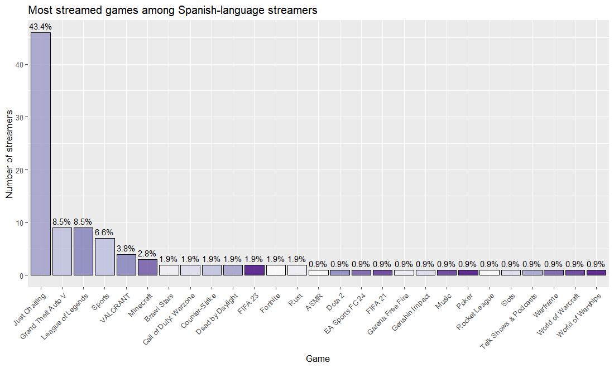


Unlike the full dataset, the Spanish-speaking community changes a little, but **Just Chatting** is still first, so viewers are also attracted by activities that are not tied to a specific game.

### Followers gained per game

Next we look at **followers gained per stream** for the games most streamed by the Spanish-speaking community, to see which games generate more **engagement**.


``` r
followers_per_game_es <- data_twitch_es %>%
  group_by(most_streamed_game) %>%
  summarise(mean_followers = mean(followers_gained_per_stream, na.rm = TRUE),
            count = n()) %>%
  arrange(desc(mean_followers))
followers_per_game_es
```

```
## # A tibble: 27 x 3
##    most_streamed_game    mean_followers count
##    <chr>                          <dbl> <int>
##  1 Minecraft                      7945.     3
##  2 Music                          7380      1
##  3 FIFA 21                        7330      1
##  4 Warframe                       7040      1
##  5 EA Sports FC 24                6534      1
##  6 Poker                          5640      1
##  7 Talk Shows & Podcasts          5230      1
##  8 Counter-Strike                 5168.     2
##  9 Just Chatting                  4876     46
## 10 Grand Theft Auto V             4795.     9
## # i 17 more rows
```


``` r
ggplot(followers_per_game_es, aes(x = reorder(most_streamed_game, -mean_followers),
                                  y = mean_followers, fill = mean_followers)) +
  geom_bar(stat = "identity", alpha = 0.8, color = "black") +
  labs(title = "Mean followers gained per stream, by game (Spanish-language)",
       x = "Most streamed game", y = "Mean followers gained per stream") +
  theme(axis.text.x = element_text(angle = 45, hjust = 1), legend.position = "none") +
  scale_fill_gradient(low = "#E0E0F7", high = "#4A148C")
```

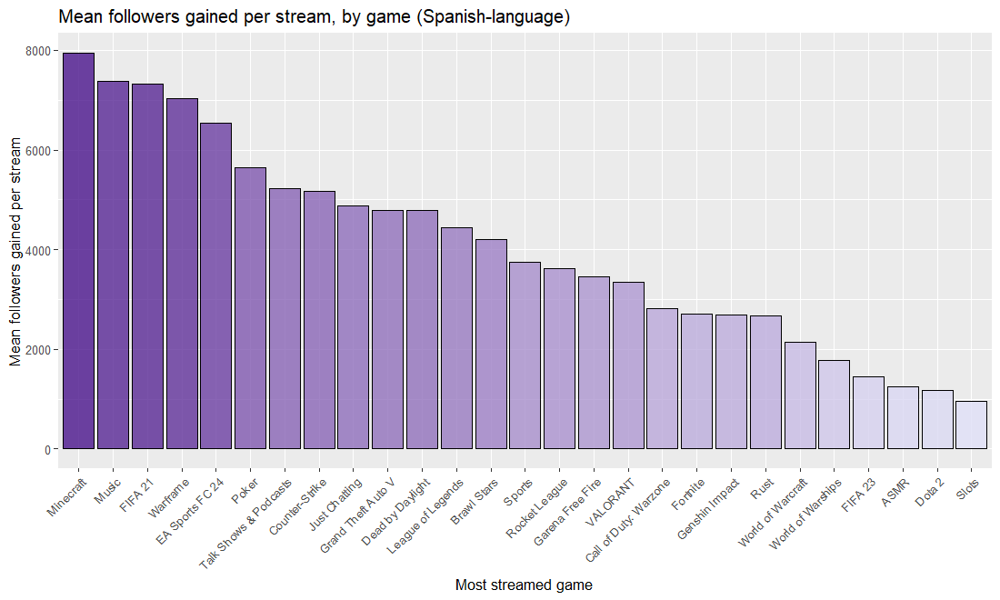


The mean can be distorted by outliers and by games with very few observations: **14 of the 27 categories have a single streamer**. For example, **Minecraft** has the highest mean (**7,945**) but only **3 streamers**, whereas **Just Chatting** (**46 streamers**, mean **4,876**) is much better supported. A boxplot shows the full distribution:


``` r
ggplot(data_twitch_es, aes(x = reorder(most_streamed_game, -followers_gained_per_stream, FUN = median),
                           y = followers_gained_per_stream)) +
  geom_boxplot(fill = "purple") +
  labs(title = "Distribution of followers gained per stream, by game (Spanish-language)",
       x = "Most streamed game", y = "Followers gained per stream") +
  theme(axis.text.x = element_text(angle = 45, hjust = 1))
```

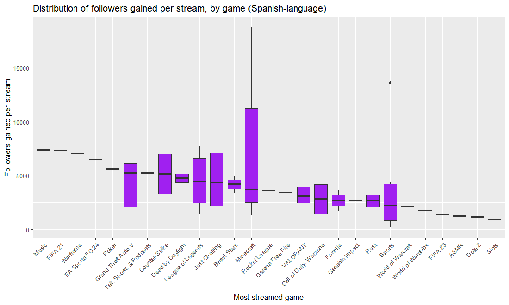

Games with only one observation should be treated as secondary options. Among the rest, **Just Chatting, Grand Theft Auto V, Minecraft and League of Legends** stand out as options worth exploring in more depth. Their boxplots differ: in some, the median sits low in the box (most streamers have modest results, a few have very high ones, so the game is an *opportunity* only if the streamer learns from the high performers); in others, the median is high but the box is long (good engagement on average, with high variability between streamers). Games with a similar median and many observations are the "safe" options, where strategy matters most.

### Top games by weekday and viewers


``` r
top_games_by_day_viewers <- data_twitch_es %>%
  group_by(most_active_day, most_streamed_game) %>%
  summarise(total_viewers = sum(avg_viewers_per_stream, na.rm = TRUE), .groups = "drop_last") %>%
  arrange(most_active_day, desc(total_viewers)) %>%
  group_by(most_active_day) %>%
  slice_head(n = 5)

top_games_by_day_viewers$most_active_day <- factor(
  top_games_by_day_viewers$most_active_day,
  levels = c("Monday", "Tuesday", "Wednesday", "Thursday", "Friday", "Saturday", "Sunday"))

custom_palette <- c("#8682bd", "#4c3f77", "#7c587f", "#a4bcbc", "#051126",
                    "purple", "#007f97", "#f3f6e9", "#bcd8f9", "#5c87ba",
                    "#6c5397", "#8d6cb1", "#4a2b7e", "#2e4277", "#abc4b8",
                    "#f4b2c1", "#ad99d5", "#639eaf", "#95d0d1", "#3e5b82")
```


``` r
ggplot(top_games_by_day_viewers,
       aes(x = most_active_day, y = total_viewers, fill = most_streamed_game)) +
  geom_bar(stat = "identity", position = "dodge") +
  labs(title = "Top 5 games by weekday, by total viewers",
       x = "Day of the week", y = "Total viewers", fill = "Game") +
  scale_fill_manual(values = custom_palette) +
  theme_minimal() +
  theme(axis.text.x = element_text(angle = 45, hjust = 1),
        plot.title = element_text(size = 16, face = "bold", hjust = 0.5),
        legend.position = "bottom")
```

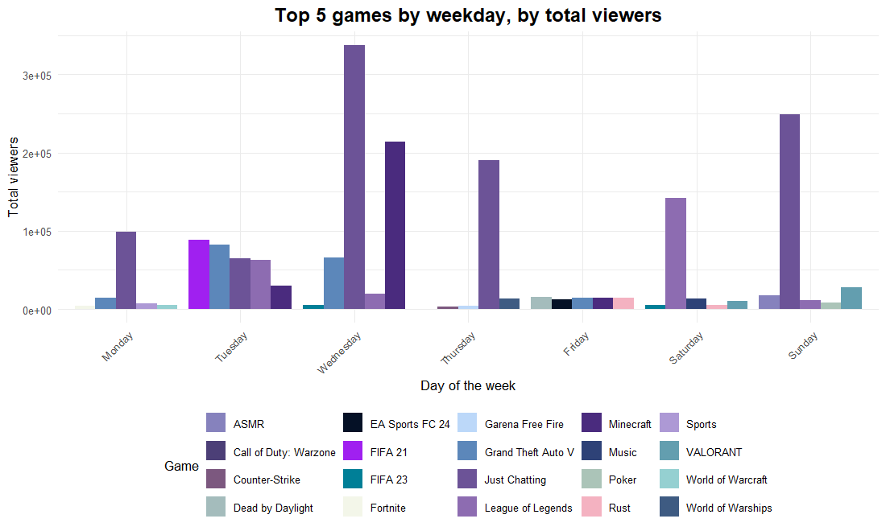

Combining this chart with the previous ones, we can draft a plan of which games to stream depending on the day and audience interest. The same categories keep appearing, so they are the main ones in the recommendation.

### Most active days in the Spanish-speaking community


``` r
active_days_es <- data_twitch_es %>%
  count(most_active_day) %>%
  arrange(desc(n)) %>%
  mutate(percentage = n / sum(n) * 100)
active_days_es
```

```
## # A tibble: 7 x 3
##   most_active_day     n percentage
##   <chr>           <int>      <dbl>
## 1 Tuesday            26      24.5 
## 2 Wednesday          26      24.5 
## 3 Sunday             14      13.2 
## 4 Thursday           13      12.3 
## 5 Monday             10       9.43
## 6 Friday              9       8.49
## 7 Saturday            8       7.55
```


``` r
ggplot(active_days_es, aes(x = reorder(most_active_day, -n), y = n)) +
  geom_bar(stat = "identity", fill = "#4A148C", color = "black") +
  geom_text(aes(label = paste0(round(percentage, 1), "%")), vjust = -0.5, size = 3.5) +
  labs(title = "Most active days in the Spanish-speaking community",
       x = "Day", y = "Number of streamers") +
  theme(axis.text.x = element_text(angle = 90, hjust = 1))
```

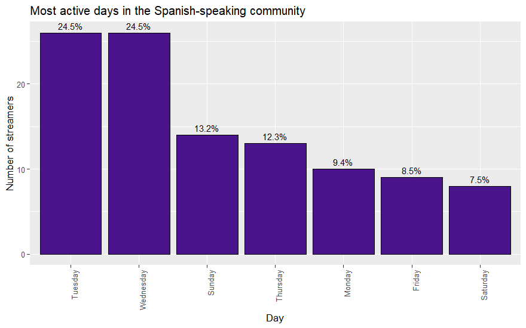


The most active days among Spanish-speaking streamers are **Tuesday, Wednesday, Sunday**. Now the days with the most **viewer** activity:


``` r
views_by_day <- data_twitch_es %>%
  group_by(most_active_day) %>%
  summarise(total_views = sum(total_views, na.rm = TRUE)) %>%
  arrange(desc(total_views)) %>%
  mutate(total_views_millions = total_views / 1e6)
views_by_day
```

```
## # A tibble: 7 x 3
##   most_active_day total_views total_views_millions
##   <chr>                 <dbl>                <dbl>
## 1 Wednesday        1016293798               1016. 
## 2 Thursday          581647078                582. 
## 3 Sunday            374795000                375. 
## 4 Tuesday           310346000                310. 
## 5 Saturday          305287000                305. 
## 6 Monday            286790000                287. 
## 7 Friday             85456000                 85.5
```


``` r
ggplot(views_by_day, aes(x = reorder(most_active_day, -total_views), y = total_views_millions)) +
  geom_bar(stat = "identity", fill = "#4A148C", color = "black") +
  geom_text(aes(label = paste0(round(total_views_millions, 2), "M")), vjust = -0.5, size = 3.5) +
  labs(title = "Days with the most views in the Spanish-speaking community",
       x = "Day", y = "Total views (millions)") +
  theme_minimal() +
  theme(axis.text.x = element_text(angle = 45, hjust = 1))
```

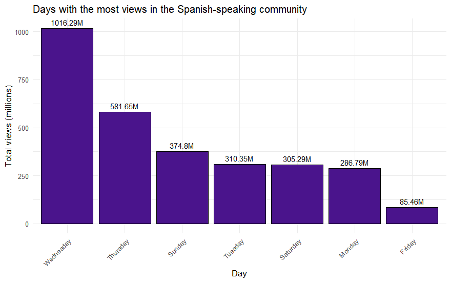


``` r
best_follower_day_es <- data_twitch_es %>%
  count(day_with_most_followers_gained) %>%
  arrange(desc(n))
best_follower_day_es
```

```
## # A tibble: 7 x 2
##   day_with_most_followers_gained     n
##   <chr>                          <int>
## 1 Sunday                            32
## 2 Monday                            17
## 3 Saturday                          15
## 4 Wednesday                         13
## 5 Friday                            12
## 6 Tuesday                            9
## 7 Thursday                           8
```


``` r
ggplot(best_follower_day_es, aes(x = reorder(day_with_most_followers_gained, -n), y = n)) +
  geom_bar(stat = "identity", fill = "#4A148C", color = "black") +
  geom_text(aes(label = n), vjust = -0.5, size = 3.5) +
  labs(title = "Day with most followers gained (Spanish-speaking community)",
       x = "Day", y = "Number of streamers") +
  theme_minimal() +
  theme(axis.text.x = element_text(angle = 45, hjust = 1))
```

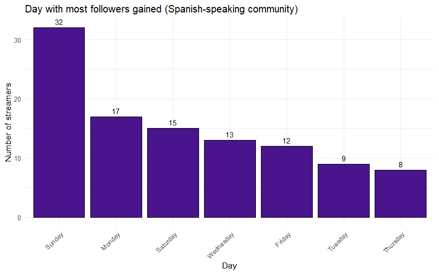

The day with the most views is **Wednesday**, and the day on which most streamers reached their follower peak is **Sunday**. The "day with most followers gained" is a single value per streamer and depends on many factors, so it carries less information; still, it is striking that about **46%** of streamers had their follower peak on a Sunday or Monday.


``` r
merged_data <- views_by_day %>%
  left_join(active_days_es, by = "most_active_day") %>%
  left_join(best_follower_day_es, by = c("most_active_day" = "day_with_most_followers_gained")) %>%
  rename(streamers = n.x, followers_gained = n.y) %>%
  select(most_active_day, total_views, streamers, followers_gained)

merged_data_long <- merged_data %>%
  pivot_longer(cols = c(total_views, streamers, followers_gained),
               names_to = "metric", values_to = "value") %>%
  group_by(metric) %>%
  mutate(value_normalized = (value - min(value)) / (max(value) - min(value))) %>%
  ungroup()
```


``` r
ggplot(merged_data_long, aes(x = most_active_day, y = value_normalized, fill = metric)) +
  geom_bar(stat = "identity", position = "dodge") +
  labs(title = "Comparison by weekday: active streamers, views and followers",
       x = "Day of the week", y = "Normalised value (0-1)", fill = "Metric") +
  scale_fill_manual(values = c("total_views" = "#051126", "streamers" = "purple",
                               "followers_gained" = "#c6bed8")) +
  theme_minimal() +
  theme(axis.text.x = element_text(angle = 45, hjust = 1))
```

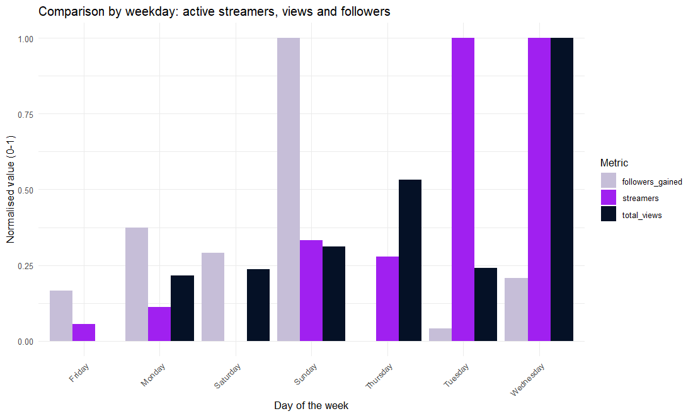

In my view the most relevant variables here are the days on which content creators stream the most and the days with the most views. As a recommendation, my friend should focus his energy on **Wednesday, Thursday and Sunday**.

### Correlation between numeric variables

Having compared the main categorical variables, we now check the correlation between numeric variables, to see whether our earlier hypotheses are supported by evidence.


``` r
numeric_variables <- data_twitch %>% select(where(is.numeric))
correlation_matrix <- cor(numeric_variables, use = "complete.obs")
```


``` r
corrplot(correlation_matrix,
         method = "color",
         col = colorRampPalette(c("red", "white", "purple"))(200),
         type = "lower", order = "hclust",
         tl.cex = 0.8, tl.col = "black", cl.cex = 0.8,
         title = "Correlation matrix", mar = c(0, 0, 1, 0),
         addCoef.col = "black", number.cex = 0.7, diag = FALSE)
```

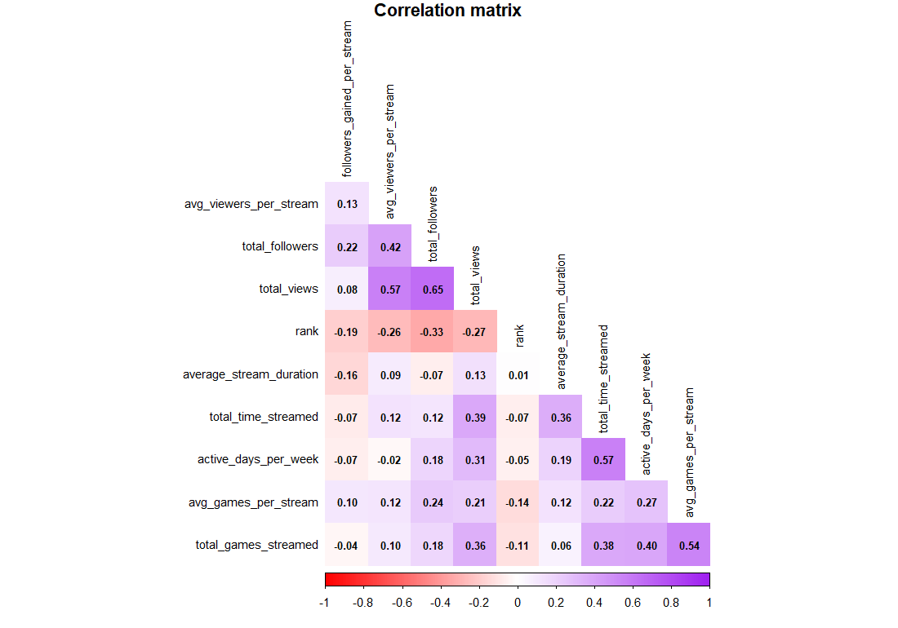


The strongest absolute correlation is **0.65**, so there are no strongly correlated numeric variables. We consider correlations between **0.5 and 0.7** as *moderate* and focus on them:


|var_1                  |var_2                | correlation|
|:----------------------|:--------------------|-----------:|
|total_followers        |total_views          |        0.65|
|avg_viewers_per_stream |total_views          |        0.57|
|active_days_per_week   |total_time_streamed  |        0.57|
|avg_games_per_stream   |total_games_streamed |        0.54|

The next scatter plots (Spanish-language streamers) illustrate the most relevant pairs.


``` r
scatter_theme <- theme_minimal() +
  theme(plot.title = element_text(size = 15, face = "bold", hjust = 0.5),
        axis.title.x = element_text(margin = margin(t = 20)),
        axis.title.y = element_text(margin = margin(r = 20)))

ggplot(data_twitch_es, aes(x = total_views, y = avg_viewers_per_stream)) +
  geom_point(aes(color = avg_viewers_per_stream), size = 3, alpha = 0.7) +
  scale_color_viridis_c(option = "magma") +
  geom_smooth(method = "lm", color = "blue", linetype = "dashed", linewidth = 1) +
  labs(title = "Total views vs average viewers per stream",
       x = "Total views", y = "Average viewers per stream", color = "Avg viewers") +
  scatter_theme
```

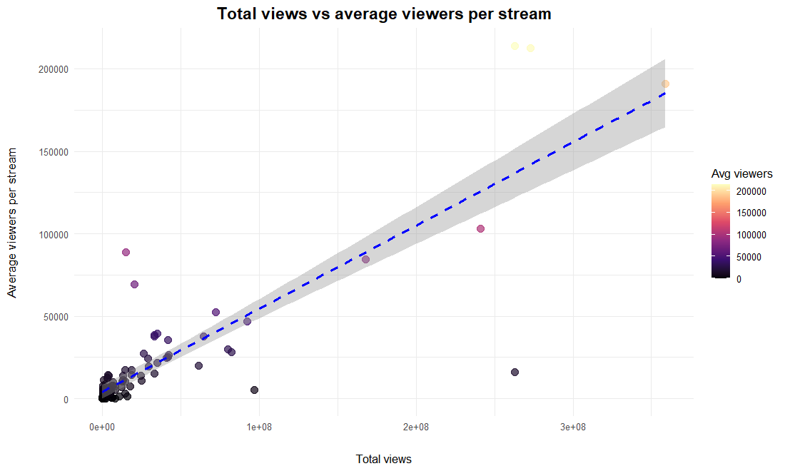


``` r
ggplot(data_twitch_es, aes(x = total_views, y = total_followers)) +
  geom_point(aes(color = total_followers), size = 3, alpha = 0.7) +
  scale_color_viridis_c(option = "magma") +
  geom_smooth(method = "lm", color = "blue", linetype = "dashed", linewidth = 1) +
  labs(title = "Total views vs total followers",
       x = "Total views", y = "Total followers", color = "Followers") +
  scatter_theme
```

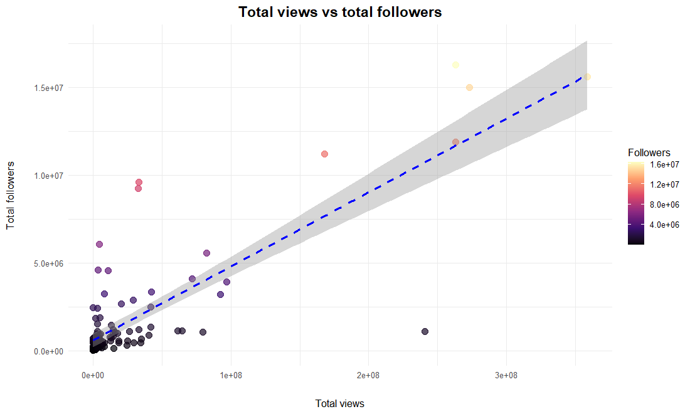

In both plots, as total views increase, average viewers per stream and total followers also tend to increase, although not perfectly. That makes sense: channels with more views attract more viewers per broadcast and more followers.


``` r
ggplot(data_twitch_es, aes(x = active_days_per_week, y = total_time_streamed)) +
  geom_point(aes(color = total_time_streamed), size = 3, alpha = 0.7) +
  scale_color_viridis_c(option = "magma") +
  geom_smooth(method = "lm", color = "blue", linetype = "dashed", linewidth = 1) +
  labs(title = "Active days per week vs total time streamed",
       x = "Active days per week", y = "Total time streamed (hours)", color = "Hours") +
  scatter_theme
```

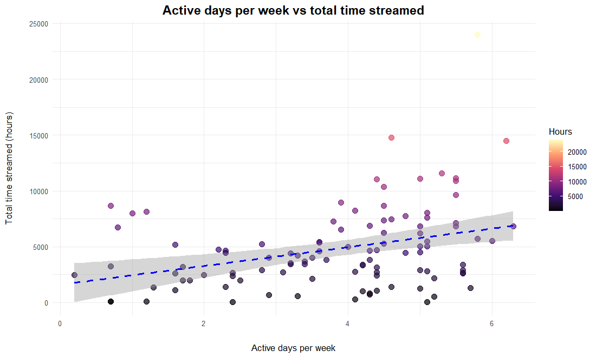

Here the relationship looks more symmetric, with a slight upward trend: streamers with few active days (1-2) tend to have lower total time streamed, and total time increases with active days. Most streamers concentrate in moderate ranges (3-4 days per week); few stream 6-7 days a week, possibly because of fatigue.


``` r
ggplot(data_twitch_es, aes(x = total_games_streamed, y = avg_games_per_stream)) +
  geom_point(aes(color = avg_games_per_stream), size = 3, alpha = 0.7) +
  scale_color_viridis_c(option = "magma") +
  geom_smooth(method = "lm", color = "blue", linetype = "dashed", linewidth = 1) +
  labs(title = "Total games streamed vs average games per stream",
       x = "Total games streamed", y = "Average games per stream", color = "Avg games") +
  scatter_theme
```

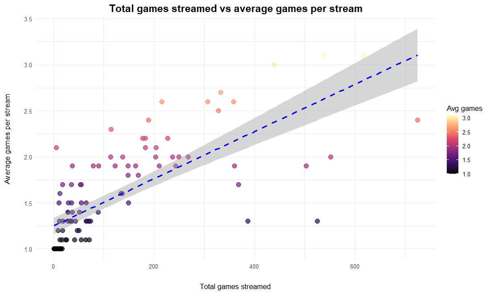

Most streamers sit in the lower-left/middle area: a relatively low total number of games, with a positive trend consistent with the moderate correlation. This suggests a mix of streamers who specialise in a few games and others who play a wide variety of games in shorter sessions.


``` r
summary(data_twitch_es$average_stream_duration)
```

```
##    Min. 1st Qu.  Median    Mean 3rd Qu.    Max. 
##   1.200   3.325   4.150   4.431   5.175  20.100
```

Even though `average_stream_duration` has no strong correlation with other variables, it is an important decision for a streamer. Because my friend is just starting, he should stream close to the median or mean, around **4-5 hours**.

## Conclusions

The main goal was to analyse streaming data to help a Spanish-speaking streamer increase his recognition on Twitch. We worked with data from the most recognised channels and then filtered the Spanish-speaking community, focusing on popular games, average viewers and stream duration, using exploratory analysis and clear visualisations.

**1) Stream duration.** Average duration shows no significant correlation with viewers or followers. Among Spanish-language streamers the median is **4.2 hours** (mean 4.4), so **4-5 hours** is an intermediate point that balances exposure and audience attention.

**2) Popular games.** **Just Chatting** and **League of Legends** stand out consistently. **Grand Theft Auto V** offers good engagement and can help streamers gain followers. **Minecraft** is presented as an **opportunity**: it has the highest mean of followers gained and some streamers gain many followers with it, so it is worth studying their strategies (but the sample is tiny, only a few streamers, so this is a hypothesis to test, not a finding). **FIFA 21** and **Valorant** are also potential **opportunities** as secondary options: the data is limited but they show a good number of followers gained.

**3) Most active days.** **Wednesday, Thursday and Sunday** stand out for viewers and activity. Depending on available time, **Tuesday to Thursday plus Sunday (5 days)** are strategic days to see better results in the medium term.

**4) Viewers.** `total_views` and `total_followers` are moderately correlated, so view growth tends to go with follower growth. A good visibility strategy, for example sharing clips or short videos on **TikTok, YouTube or other platforms**, could help a lot. The most successful streams combine consistent schedules, popular games and active interaction with the community.

**5) Diversification.** Creating content on other platforms adds visibility; he can also explore less saturated games with loyal communities, alternating them with popular ones to reach new audiences. Key metrics should be monitored monthly to adjust the strategy.

### Limitations

- The data is a **single snapshot** of the top 1,000 streamers (May 2024): it shows *what successful streamers do*, not what *causes* success (survivorship bias).
- Many game categories have a handful of streamers, so category-level means are unstable.
- Correlations are moderate at best and do not imply causation.

### Final reflection

A data-driven approach can be valuable to improve a streamer's chances: consistency, strategic choice of games and a connection with the community are the main levers. These recommendations give my friend a clear roadmap to optimise his content and grow his recognition.
