## Análisis Exploratorio Bivariado

Como se mencionó anteriormente, primero filtraremos por el idioma español y veremos los juegos más stremeados para este grupo:

```r
    data_twitch_es <- data_twitch %>%
      filter(language == "Spanish")
```
```r
    most_streamed_games_es <- data_twitch_es %>%
      group_by(most_streamed_game) %>%
        summarise(count = n()) %>%
         arrange(desc(count)) %>%
           mutate(percentage = (count / sum(count)) * 100)
```
    ## # A tibble: 27 × 3
    ##    most_streamed_game    count percentage
    ##    <chr>                 <int>      <dbl>
    ##  1 Just Chatting            46      43.4 
    ##  2 Grand Theft Auto V        9       8.49
    ##  3 League of Legends         9       8.49
    ##  4 Sports                    7       6.60
    ##  5 VALORANT                  4       3.77
    ##  6 Minecraft                 3       2.83
    ##  7 Brawl Stars               2       1.89
    ##  8 Call of Duty: Warzone     2       1.89
    ##  9 Counter-Strike            2       1.89
    ## 10 Dead by Daylight          2       1.89
    ## # ℹ 17 more rows

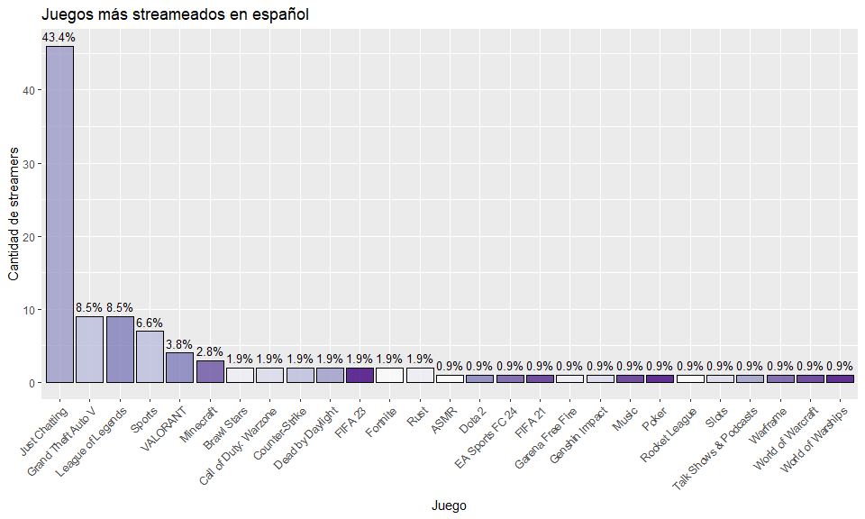 

A diferencia de los juegos más jugados en la base de datos completa, vemos que en la comunidad de habla hispana cambia un poco. Sin embargo, la categoría de **Just Chatting** sigue siendo el primer lugar, por lo que podemos deducir que a la gente también le llama la atención actividades no sólo relacionadas a los juegos.

A continuación analizaremos la variable de **seguidores ganados por stream** en los juegos más stremeados de la comunidad hispana, de tal forma de ver cuales juegos generan un mayor **engagement** y así tener esta información en consideración.

```r
    followers_per_game_es <- data_twitch_es %>%
                              group_by(most_streamed_game) %>%
                              summarise(mean_followers = mean(followers_gained_per_stream, na.rm = TRUE),
                              count = n()) %>%
                              arrange(desc(mean_followers))
```
    ## # A tibble: 27 × 3
    ##    most_streamed_game    mean_followers count
    ##    <chr>                          <dbl> <int>
    ##  1 Minecraft                      7945.     3
    ##  2 Music                          7380      1
    ##  3 FIFA 21                        7330      1
    ##  4 Warframe                       7040      1
    ##  5 EA Sports FC 24                6534      1
    ##  6 Poker                          5640      1
    ##  7 Talk Shows & Podcasts          5230      1
    ##  8 Counter-Strike                 5168.     2
    ##  9 Just Chatting                  4876     46
    ## 10 Grand Theft Auto V             4795.     9
    ## # ℹ 17 more rows

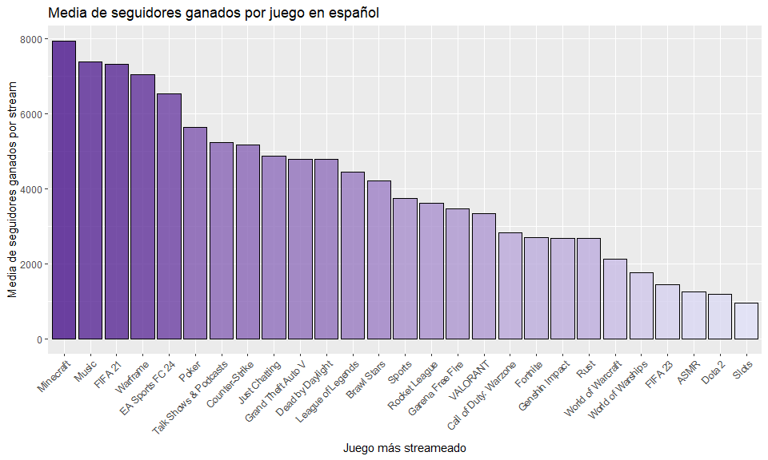 

Este gráfico nos muestra la media de seguidores ganados por juego, lo que nos da una idea del nivel promedio de **engagement** para cada juego, sin embargo, esta media puede estar influenciada por valores atípicos, pocas observaciones como lo es en el los casos de categorías como **Music, FIFA 21, Warframe** y aquellos que tienen solo una observación, etc. Para esto analizamos un boxplot:

```r
    followers_per_game_es_full <- data_twitch_es %>%
      select(most_streamed_game, followers_gained_per_stream)
```
    ## # A tibble: 106 × 2
    ##    most_streamed_game followers_gained_per_stream
    ##    <chr>                                    <dbl>
    ##  1 Just Chatting                             8289
    ##  2 Minecraft                                 1326
    ##  3 Just Chatting                             2993
    ##  4 Sports                                   13617
    ##  5 VALORANT                                  1124
    ##  6 Grand Theft Auto V                        4640
    ##  7 Just Chatting                            11592
    ##  8 Grand Theft Auto V                        6163
    ##  9 Just Chatting                            11093
    ## 10 Just Chatting                             9210
    ## # ℹ 96 more rows

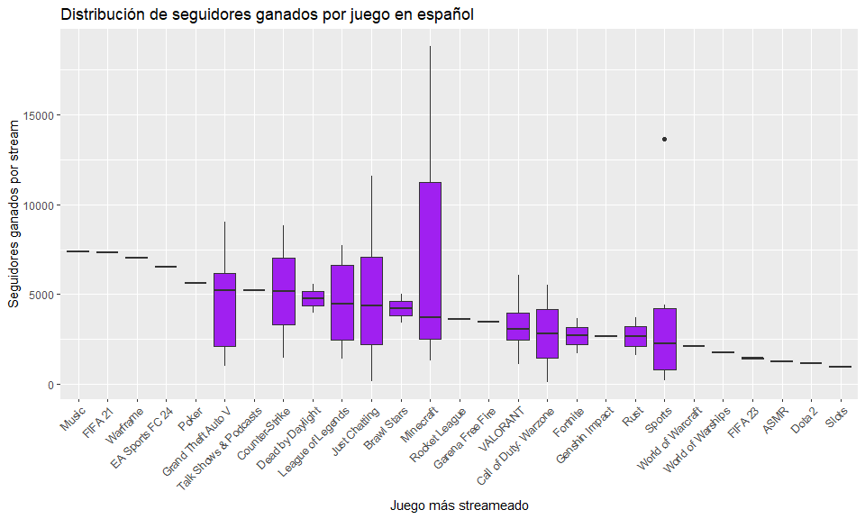 

Teniendo en consideración los gráficos anteriores, descartaremos o diremos que aquellos juegos con sólo una observación serán consideradas opciones secundarias. Dado esto, podemos ver que juegos como **Just Chatting, Grand Theft Auto V, Minecraft o League of Legends** son opciones interesantes a profundizar.

Para el caso de **Minecraft**, que es el con mayor media de seguidores ganados, vemos que la mediana se encuentra en la parte inferior del boxplot. Esto significa que la mayoría de los valores del IQR se encuentran concentrados en la parte inferior y la parte superior del IQR es más dispersa. En resumen, aunque la mayoría de los streamers tienen resultados “bajos” (mediana baja), algunos logran valores significativamente mayores. Este juego podría ser atractivo como una **oportunidad**, pero mi amigo debe aprender de los streamers que logran resultados altos para generar un mayor engagement.

Por otro lado, en el caso de **Grand Theft Auto V** la mayoría de streamers suele ganar una cantidad considerable de seguidores ya que la mediana se encuentra en la parte superior del IQR. Sin embargo, el hecho de que GTA V tenga una mediana alta y una caja larga significa que, en general, este juego genera un buen nivel de engagement, pero con una alta variabilidad entre los streamers.

Finalmente, **Just Chatting o League of Legends** tienen medianas similares y varias observaciones, por lo que en general los streamers de estos contenidos tienen una buena ganancia de seguidores y podrían ser opciones “seguras”. Aunque hay diferencias en su variabilidad y existen algunos streamers que no generan buen engagement, podriamos decir que las estrategias en este contenido son claves.

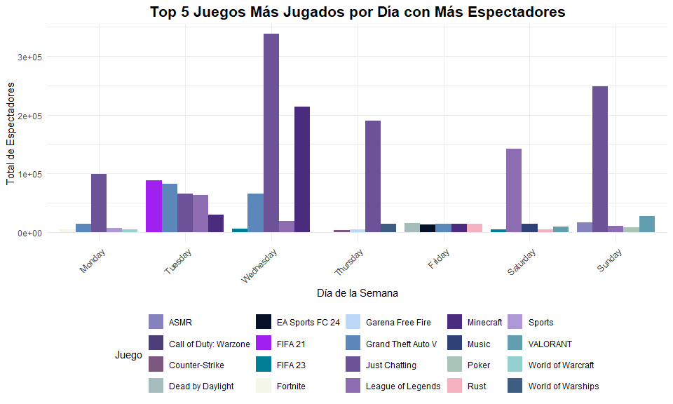 

Ya para terminar el análisis de la variable catégorica relacionada a los juegos, con este gráfico más la información obtenida anteriormente, podríamos hacer un esquema de que juegos podría mi amigo stremear dependiendo del día e interéses del público.

Categorías como, **Just Chatting**, **League of Legends**, **Grand Theft Auto V** y **Minecraft** se repiten nuevamente, por lo que sin duda son las que principalmente agregaremos a nuestra recomendación.

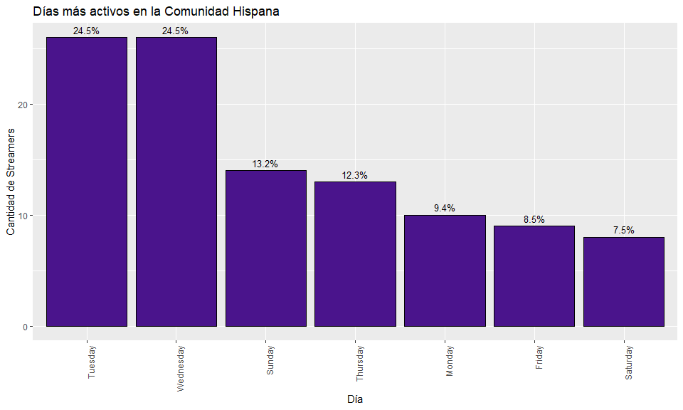 

Adicionalmente, vemos que los días más activos son los **Martes, Miércoles y Domingo**, a diferencia de cuando se consideraba el total de la base que era los **Martes, Miércoles y Jueves**. Esto, se refiere directamente a los días que los **Streamers** de habla hispana se encuentran más activos.

A continuación, analizaremos los días que hay mayor actividad por parte de los **Viewers**:

    ## # A tibble: 7 × 3
    ##   most_active_day total_views total_views_millions
    ##   <chr>                 <dbl>                <dbl>
    ## 1 Wednesday        1016293798               1016. 
    ## 2 Thursday          581647078                582. 
    ## 3 Sunday            374795000                375. 
    ## 4 Tuesday           310346000                310. 
    ## 5 Saturday          305287000                305. 
    ## 6 Monday            286790000                287. 
    ## 7 Friday             85456000                 85.5

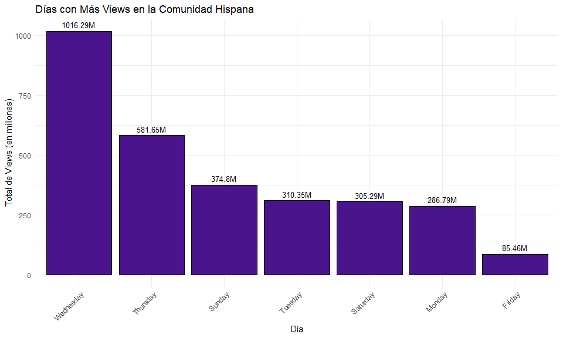

```r
    dias_mas_seguidores_es <- data_twitch_es %>%
      count(day_with_most_followers_gained) %>%
      arrange(desc(n))
```
```r
    head(dias_mas_seguidores_es, 7)
```
    ## # A tibble: 7 × 2
    ##   day_with_most_followers_gained     n
    ##   <chr>                          <int>
    ## 1 Sunday                            32
    ## 2 Monday                            17
    ## 3 Saturday                          15
    ## 4 Wednesday                         13
    ## 5 Friday                            12
    ## 6 Tuesday                            9
    ## 7 Thursday                           8

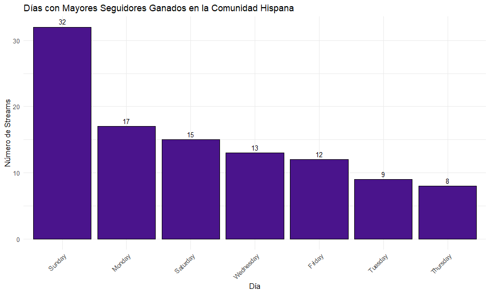 

Por otra parte, pero de la mano con lo anterior, los días con mas **Viewers o Espectadores** son los **Miércoles**. Y los días con mayores ocurrencias en máximos de seguidores ganados son los **Domingos**. Aunque quizás los días con mayores seguidores ganados no nos dan mucha información, ya que estos son valores únicos por cada Streamer y este puede depender de muchos factores. Lo que si resulta algo llamativo, es que casi el 50% de los streamers haya conseguido su máximo de seguidores en un stream, un día **Domingo o Lunes**.

    ## # A tibble: 6 × 4
    ##   most_active_day metric                value value_normalized
    ##   <chr>           <chr>                 <dbl>            <dbl>
    ## 1 Wednesday       total_views      1016293798            1    
    ## 2 Wednesday       streamers                26            1    
    ## 3 Wednesday       followers_gained         13            0.208
    ## 4 Thursday        total_views       581647078            0.533
    ## 5 Thursday        streamers                13            0.278
    ## 6 Thursday        followers_gained          8            0

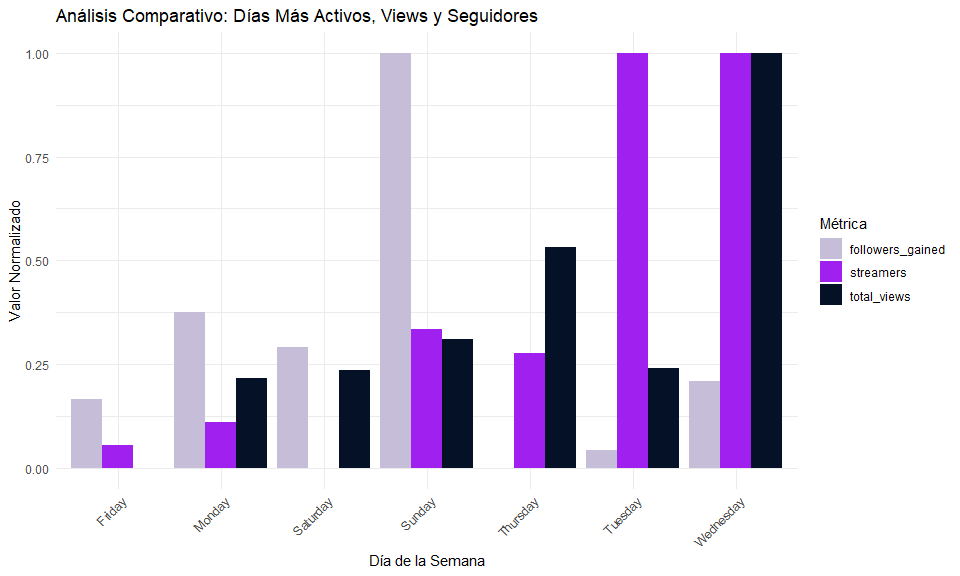 

Según mi parecer acá las variables que más importan son los días que más stremean los creadores de contenido (Streamers), y los días con mayores vistas (Viewers). Como recomendación a mi amigo le diría de enfocar su energía los días **Miércoles, Jueves y Domingo**.

Por otra parte, y ya habiendo realizado un análisis bivariado entre las variables categóricas más relevantes, realizaremos un análisis de las variables numéricas mediante una matriz de confusión. Esto, con el objetivo de ver la correlación entre las distintas variables y comprobar si nuestras hipótesis planteadas anteriormente son o no respaldadas con evidencia.

```r
    variables_numericas <- data_twitch %>%
      select_if(is.numeric)
```
```r
    correlation_matrix <- cor(variables_numericas, use = "complete.obs")
```
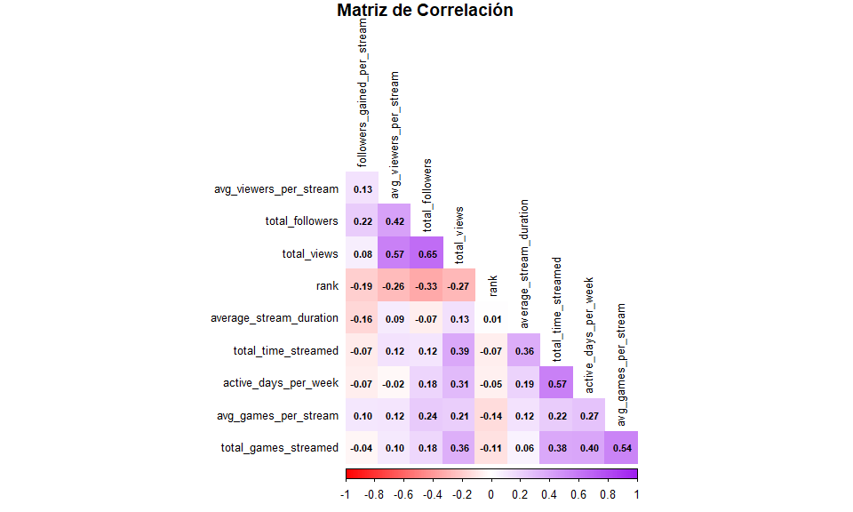 

De la matriz de correlación podemos ver que **NO** hay variables numéricas con correlación alta. Sin embargo, variables en un rango de **0.5 a 0.7** serían consideradas **moderadas** y es donde pondremos enfoque.

Correlaciones tales como:

-   **total\_views** con **avg\_viewers\_per\_stream:** 0.57
-   **total\_views** con **total\_followers:** 0.65
-   **active\_days\_per\_week** con **total\_time\_streamed:** 0.57
-   **total\_games\_streamed** con **avg\_games\_per\_stream:** 0.54

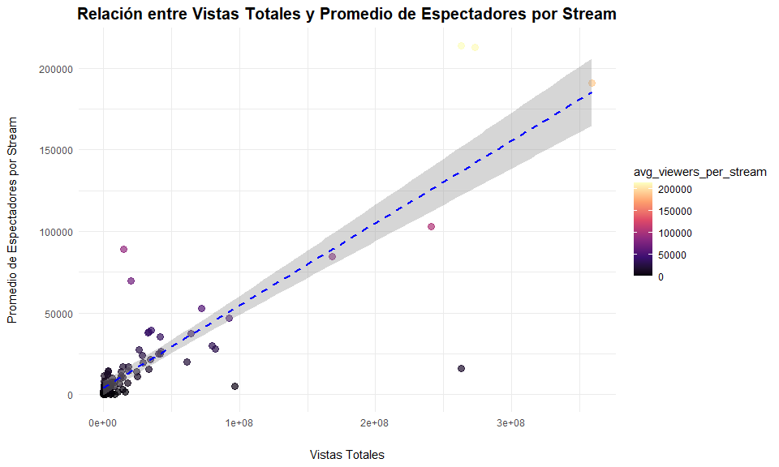

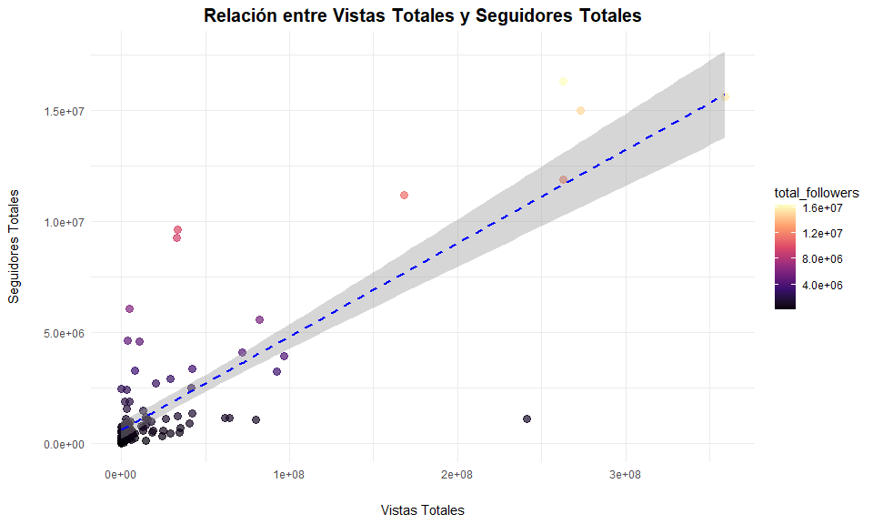 

Estos gráficos analizan la correlación de la variable Vistas Totales (total\_views) con el Promedio de Espectadores por Stream y Seguidores Totales, respectivamente.

En ambos, a medida que aumenta el total de views, el promedio de espectadores por stream y seguidores totales también tiende a aumentar, aunque no de manera perfecta. Esto tiene sentido, ya que los streams con más vistas probablemente atraen más espectadores por transmisión, lo que se ve reflejado en el promedio de espectadores y seguidores.

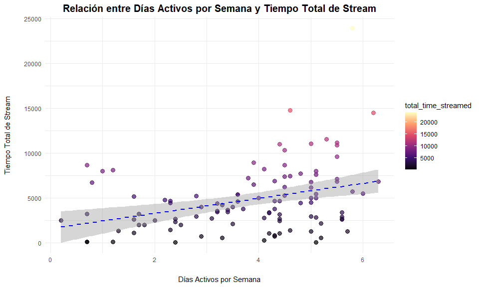 

A diferencia de los gráficos anteriores, acá podemos ver una distribución algo más “simétrica” con una pequeña línea de tendencia creciente. Es posible que los valores más bajos de **active\_days\_per\_week** (como 1 o 2 días) correspondan a **total\_time\_streamed** más bajos (usuarios que transmiten menos tiempo). A medida que **active\_days\_per\_week aumenta, total\_time\_streamed también tiende a aumentar**.

Además, vemos que existe una mayor concentración en rangos moderados de días activos (como 3-4 días por semana), y no muchos streamers están transmitiendo una cantidad de tiempo extremadamente alta (entre 6 y 7 días) por diversas razones tales como fatiga, cansancio, etc.

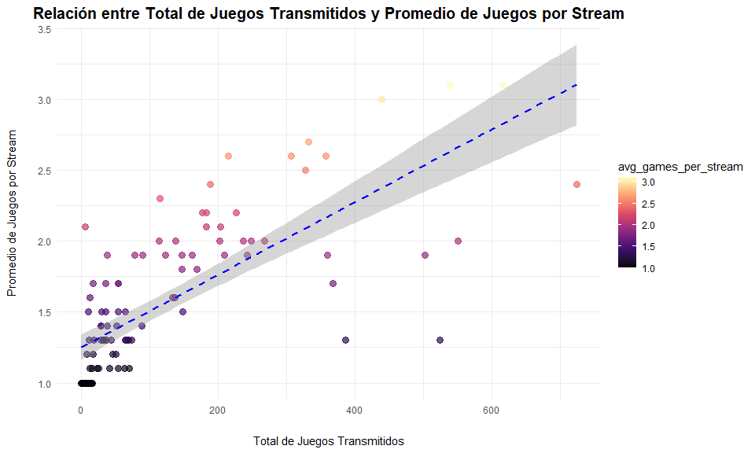 

Podemos ver una concentración en la parte izquierda e inferior/media del gráfico. En la mayoría de los casos, los streamers tienden a tener un total relativamente “bajo” de juegos transmitidos, sin embargo, de igual manera se ve una tendencia positiva que podría explicarse por su correlación moderada de 0,54.

Esto se puede interpretar como una mezcla de streamers que se especializan en pocos juegos (y por lo tanto, tienen un número bajo de juegos por stream) y otros que juegan una amplia variedad de juegos, pero en sesiones que pueden ser cortas o limitadas.

```r
    summary(data_twitch_es$average_stream_duration)
```
    ##    Min. 1st Qu.  Median    Mean 3rd Qu.    Max. 
    ##   1.200   3.325   4.150   4.431   5.175  20.100

A pesar que la variable **avg\_stream\_duration** no presenta una correlación fuerte con otras variables, creo que es importante tener en consideración, ya que una decisión clave a la hora de stremear. A mi parecer, como mi amigo está comenzando, debería stremear en rangos cercanos a la mediana o media, es decir, **entre 4 y 5 horas**.

## Conclusiones

El objetivo principal de este proyecto fue analizar datos de streamings para ayudar a mi amigo a incrementar su reconocimiento como streamer en la plataforma. Para lograrlo, trabajamos con datos de los canales más reconocidos, y posteriormente filtramos para la comunidad en español, ya que es el idioma de preferencia de mi amigo. Enfocándonos en variables como juegos más populares, promedio de espectadores, duración de streams, entre otras. Utilizamos técnicas de análisis exploratorio y visualizaciones claras para identificar patrones significativos.

A continuación describiremos algunos hallazgos encontrados que serán finalmente, recomendaciones para mi amigo y los canales que vienen ya con una comunidad y quieren llevar su stream al siguiente nivel:

**1) Patrones en la Duración de Streams:**

La duración promedio de los streams no mostró una correlación significativa con otras variables como viewers o followers. Sin embargo, la mediana de duración más efectiva está alrededor **de 4 a 5 horas**, lo que parece ser un punto intermedio que balancea el tiempo de exposición sin perder la atención de los espectadores.

**2) Juegos Más Populares:**

Los juegos más transmitidos varían según el día de la semana. Por ejemplo, **“Just Chatting” y “League of Legends”** destacan consistentemente entre los más populares. Estos juegos atraen a una mayor cantidad de espectadores y podrían ser clave para construir una base de seguidores fieles.

Por otro lado, tenemos juegos como **Grand Theft Auto V** que tienen un buen engagement con el público y los datos muestran que es un juego que permite a los streamers obtener buenos seguidores y por ende, mayor exposición.

Finalmente, vemos que **Minecraft** es un juego que sería presentado como una **oportunidad** para destacar ya que tiene un buen potencial y existen streamers que consiguen muchos seguidores gracias a este juego. Es importante considerar las estrategias y copiarse de aquellos streamers que ya tienen éxito.

Otros dos juegos que a mi parecer representan una **oportunidad**, serían el **FIFA 21** y **Valorant**, ya que si bien vemos que no tienen sufiiente data, son juegos que tienen una buena cantidad de seguidores obtenidos y están dentro del Top 5 más jugados. Creo que mi amigo podría agregarlos a su lista como opciones secundarias.

**3) Días de mayor actividad:**

**Miércoles, Jueves y Domingo** destacan como los días con mayor cantidad de viewers promedio, sugiriendo que estos días son estratégicos para transmitir y captar más público. Mi recomendación sería dependiendo del tiempo disponible de mi amigo, sin embargo, **días entre Martes a Jueves y Domingo (5 días)** son días estratégicos en los que podría ver mejores resultados a mediano plazo.

**4) Relación con los Viewers:**

Vimos como variables como **total\_views** y **total\_followers** están moderadamente correlacionadas, indicando que el crecimiento en vistas impulsa el aumento de seguidores. Esto es clave, ya que, si mi amigo tiene una buena estrategia de visibilidad podría incrementar considerablemente su cantidad de seguidores. Esrategias como dar visibilidad a su canal mediante clips o videos cortos en **Tik Tok, Youtube, u otras plataformas**, podrían ayudarlo mucho a crecer.

Las transmisiones más exitosas combinan consistencia en los horarios, elección de juegos populares y una interacción activa con la comunidad.

**5) Diversificación:**

De la mano con el punto anterior, crear contenido para otras plataformas podría dar visibilidad considerable, sin embargo, mi amigo también podría explorar juegos menos saturados pero con comunidades fieles, alternando con los más populares para captar nuevas audiencias.

Es importante monitorear métricas clave mensualmente para ajustar la estrategia según el rendimiento y tendencias actuales.

## Reflexión Final

El análisis realizado demuestra que un enfoque basado en datos puede ser invaluable para mejorar las posibilidades de éxito como streamer. Mi amigo ahora cuenta con una hoja de ruta clara para optimizar su contenido y aumentar su reconocimiento, destacando la importancia de la consistencia, la elección estratégica de juegos y la conexión con su comunidad. **¡Con estas recomendaciones, está más cerca de alcanzar su meta de ser un streamer destacado!**
