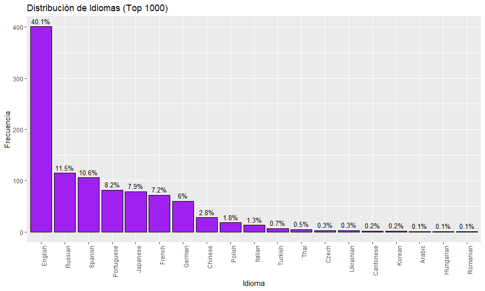
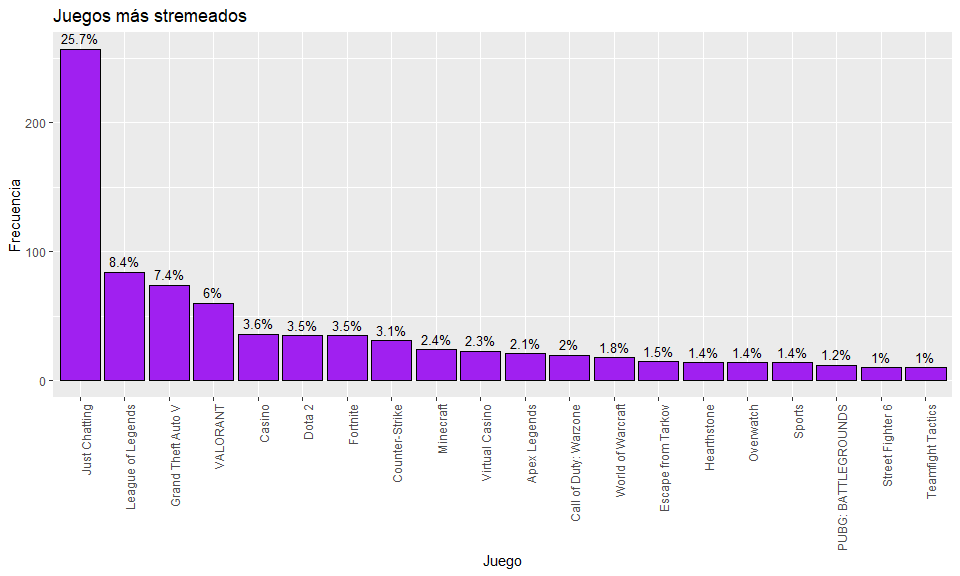
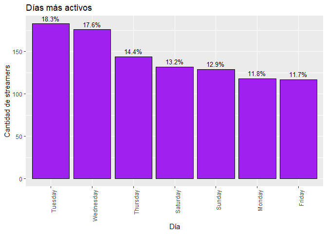
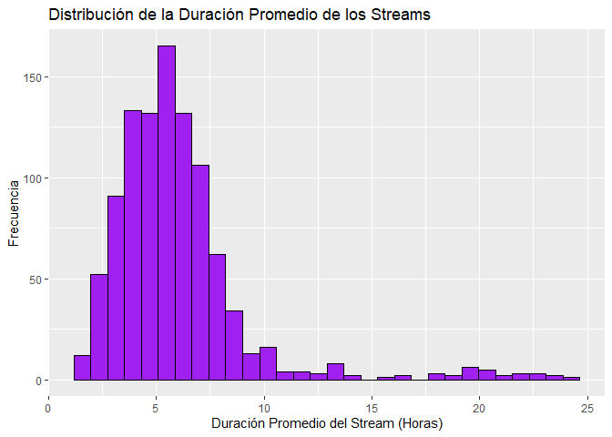
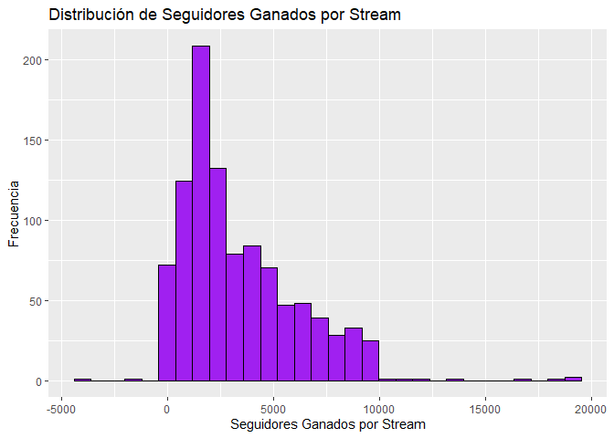
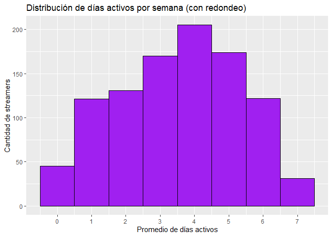

## Análisis Exploratorio Univariado

En esta segunda parte, realizaremos un análisis individual de las variables más importantes o que en primera instancia, podrían resultar como las más relevantes para nuestro estudio. Recordemos que la pregunta
a responder de nuestro proyecto es: **¿Cómo puede un streamer, especialmente en sus primeros años, identificar y priorizar las estrategias más efectivas para maximizar su crecimiento y escalar más rápido en Twitch?**

A continuación haremos un análisis en las siguientes variables categóricas:

-   LANGUAGE (IDIOMA)
-   MOST\_STREAMED\_GAME (JUEGO MÁS STREMEADO)
-   MOST\_ACTIVE\_DAY (DÍA MÁS ACTIVO)

<!-- -->
```r
    data_proporciones <- data_twitch %>%
                          count(language) %>%                          
                           mutate(percentage = n / sum(n) * 100)
```
    ## # A tibble: 19 × 3
    ##    language       n percentage
    ##    <chr>      <int>      <dbl>
    ##  1 Arabic         1      0.100
    ##  2 Cantonese      2      0.200
    ##  3 Chinese       28      2.80 
    ##  4 Czech          3      0.300
    ##  5 English      401     40.1  
    ##  6 French        72      7.21 
    ##  7 German        60      6.01 
    ##  8 Hungarian      1      0.100
    ##  9 Italian       13      1.30 
    ## 10 Japanese      79      7.91 
    ## 11 Korean         2      0.200
    ## 12 Polish        18      1.80 
    ## 13 Portuguese    82      8.21 
    ## 14 Romanian       1      0.100
    ## 15 Russian      115     11.5  
    ## 16 Spanish      106     10.6  
    ## 17 Thai           5      0.501
    ## 18 Turkish        7      0.701
    ## 19 Ukrainian      3      0.300



Podemos ver que el idioma Inglés es el predominante en nuestra base de datos. Sin embargo, el español representa un 10.6% del top 1000 streamers. Probablemente si tomamos una muestra mayor el porcentaje o
comportamiento sería similar. Este dato es muy relevante ya que, hablar inglés aumentaría significativamente nuestras posibilidades de que mi amigo sea famoso, pero como su comunidad es de habla hispana, tendremos que enfocarnos directamente en ese “filtro” o bien, recomendar a mi amigo considerar hacer colaboraciones con streamers de habla inglesa.

Por ahora nos enfocaremos en analizar las variables que consideramos más importantes, sin tomar en cuenta el idioma, pero teniéndolo en cuenta. Podemos ver los juegos más stremeados nos dan algún indicio de donde está el interés de los espectadores.
```r
    top_veinte_juegos <- data_twitch %>% 
      count(most_streamed_game) %>% 
         mutate(percentage = n / sum(n) * 100) %>% 
            arrange(desc(n)) %>% 
              head(20)
```
```r
    print(top_veinte_juegos)
```
    ## # A tibble: 20 × 3
    ##    most_streamed_game        n percentage
    ##    <chr>                 <int>      <dbl>
    ##  1 Just Chatting           257      25.7 
    ##  2 League of Legends        84       8.41
    ##  3 Grand Theft Auto V       74       7.41
    ##  4 VALORANT                 60       6.01
    ##  5 Casino                   36       3.60
    ##  6 Dota 2                   35       3.50
    ##  7 Fortnite                 35       3.50
    ##  8 Counter-Strike           31       3.10
    ##  9 Minecraft                24       2.40
    ## 10 Virtual Casino           23       2.30
    ## 11 Apex Legends             21       2.10
    ## 12 Call of Duty: Warzone    20       2.00
    ## 13 World of Warcraft        18       1.80
    ## 14 Escape from Tarkov       15       1.50
    ## 15 Hearthstone              14       1.40
    ## 16 Overwatch                14       1.40
    ## 17 Sports                   14       1.40
    ## 18 PUBG: BATTLEGROUNDS      12       1.20
    ## 19 Street Fighter 6         10       1.00
    ## 20 Teamfight Tactics        10       1.00



Curiosamente un **25.7%** de los juegos más stremeados es **Just Chatting**, categoría la cual solamente se habla o se hacen actividades que no están relacionadas con un juego en específico. Ya con una diferencia considerable, posteriormente le siguen **League of Legends, GTA V y Valorant**. Como última variable individual categórica, analizaremos el día con mayor actividad.

```r
    dias_mas_activos <- data_twitch %>% 
      count(most_active_day) %>% 
      mutate(percentage = n / sum(n) * 100) %>% 
      arrange(desc(n))
```
```r
    print(dias_mas_activos)
```
    ## # A tibble: 7 × 3
    ##   most_active_day     n percentage
    ##   <chr>           <int>      <dbl>
    ## 1 Tuesday           183       18.3
    ## 2 Wednesday         176       17.6
    ## 3 Thursday          144       14.4
    ## 4 Saturday          132       13.2
    ## 5 Sunday            129       12.9
    ## 6 Monday            118       11.8
    ## 7 Friday            117       11.7



De esto, podemos inferir que los días intermedios de la semana dominan. Días **Martes, Miércoles y Jueves** concentran una gran parte de las observaciones, representando un 50.3% del total. Esto podría reflejar una tendencia a realizar estas actividades en días laborales.

A continuación analizaremos las variables numéricas:

-   AVERAGE\_STREAM\_DURATION (DURACIÓN PROMEDIO DE STREAM)
-   FOLLOWERS\_GAINED\_PER\_STREAM (SEGUIDORES GANADOS POR STREAM)
-   ACTIVE\_DAYS\_PER\_WEEK (DÍAS ACTIVOS POR SEMANA)
-   TOTAL\_TIME\_STREAMED (TIEMPO TOTAL STREMEADO)
-   TOTAL\_FOLLOWERS (SEGUIDORES TOTALES)

**¿Y porqué analizaremos estas variables?**

Analizar estas métricas nos ayudarán a identificar qué comportamientos y características hacen que los streamers crezcan rápidamente. De esto, podremos tener una idea en cómo afecta la cantidad de tiempo transmitido a la cantidad de seguidores ganados por stream, cuántos días a la semana se necesita estar activo para maximizar el crecimiento o si hay una relación entre la duración del stream y el número de seguidores ganados.

**1) AVERAGE\_STREAM\_DURATION (DURACIÓN PROMEDIO DE STREAM)**
```r
    summary(data_twitch$average_stream_duration)
```
    ##    Min. 1st Qu.  Median    Mean 3rd Qu.    Max. 
    ##   1.200   4.200   5.400   5.997   6.900  23.900



**2) FOLLOWERS\_GAINED\_PER\_STREAM (SEGUIDORES GANADOS POR STREAM)**
```r
    summary(data_twitch$followers_gained_per_stream)
```
    ##    Min. 1st Qu.  Median    Mean 3rd Qu.    Max. 
    ##   -4240    1360    2450    3383    4832   18889



**3) ACTIVE\_DAYS\_PER\_WEEK (DÍAS ACTIVOS POR SEMANA)**
```r
    summary(data_twitch$active_days_per_week)
```
    ##    Min. 1st Qu.  Median    Mean 3rd Qu.    Max. 
    ##   0.000   2.200   3.800   3.591   5.100   7.000



**4) TOTAL\_TIME\_STREAMED (TIEMPO TOTAL STREMEADO)**
```r
    summary(data_twitch$total_time_streamed)
```
    ##    Min. 1st Qu.  Median    Mean 3rd Qu.    Max. 
    ##      27    2066    4756    6505    8871   90920

**5) TOTAL\_FOLLOWERS (SEGUIDORES TOTALES)**
```r
    summary(data_twitch$total_followers)
```
    ##     Min.  1st Qu.   Median     Mean  3rd Qu.     Max. 
    ##        0   187500   437000   919403   889500 19000000

Este análisis univariado y exploratorio inicial nos permite identificar variables clave para ayudar a mi amigo a crecer en Twitch. Las variables categóricas muestran que el idioma, los juegos populares y los días activos pueden influir en la visibilidad. Las variables numéricas nos muestran distribuciones, valores medios y técnicas o comportamientos que utilizan los mejores creadores de contenido en Twitch que serviriían eventualmente a mi amigo, para replicar.

Si bien, este análisis aún no nos garantiza que el hecho de aumentar la frecuencia de transmisiones o el tiempo total transmitido contribuye al crecimiento del canal, podría darnos la idea de que sí. Por ahora, y de este análisis inicial podemos decir que mi amigo, por el hecho de tener una comunidad de habla hispana tiene que maximizar su visibilidad desde todos los aspectos posibles, ya que en este caso, está en desventaja.

Pero como dijo Nico Massú… **NADA ES IMPOSIBLE \#“$%@, NI UNA \#%@**, así que a continuación exploraremos las variables en conjunto con el filtro del idioma **Español**.
